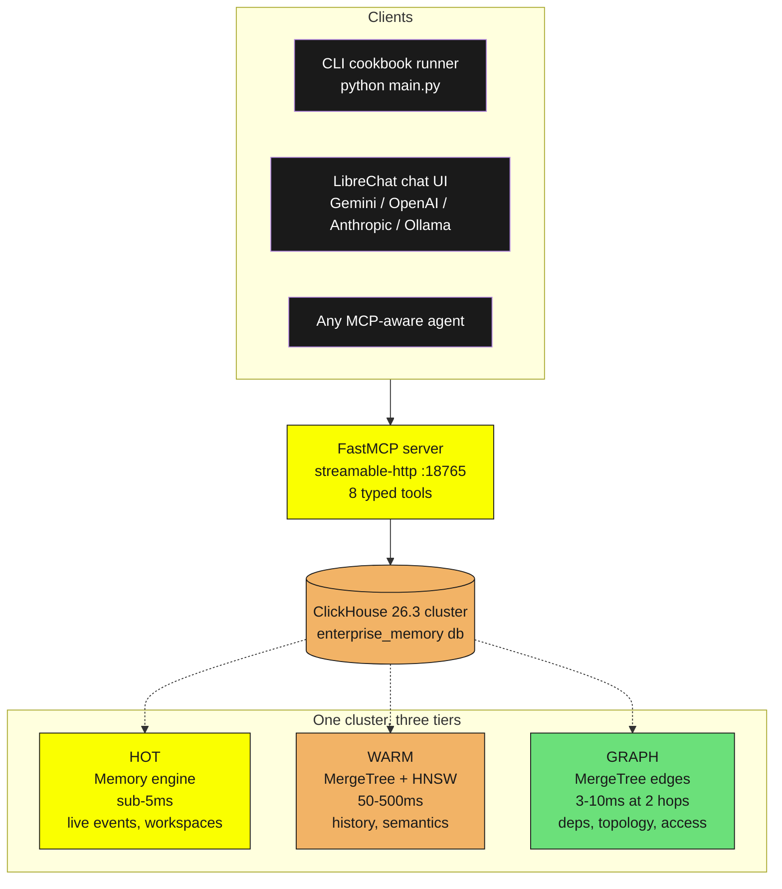
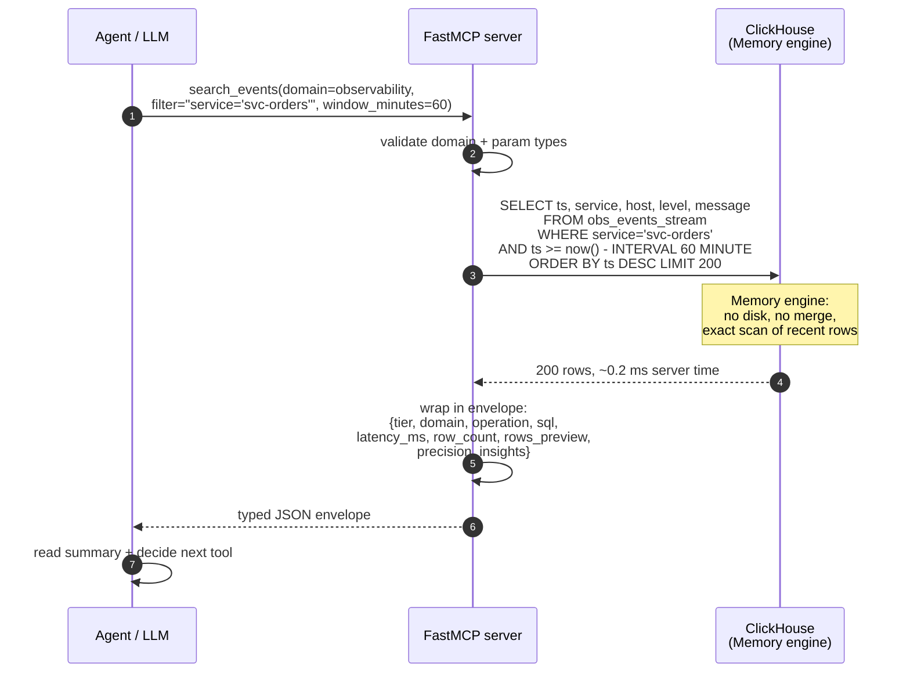
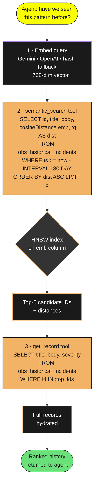
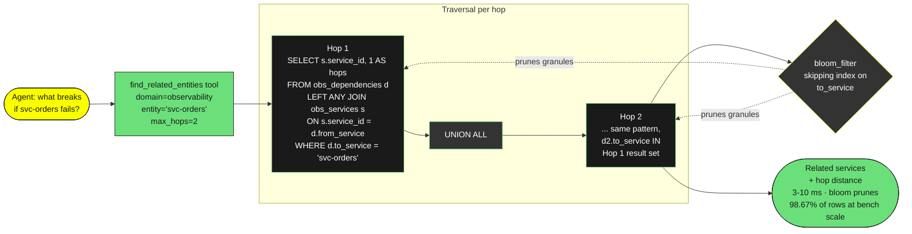
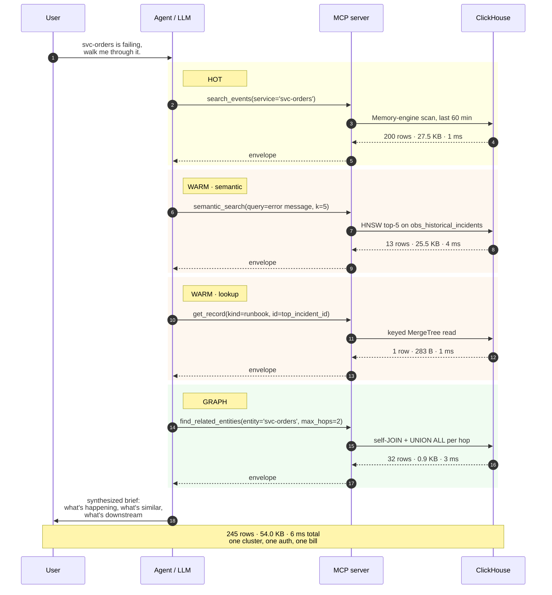
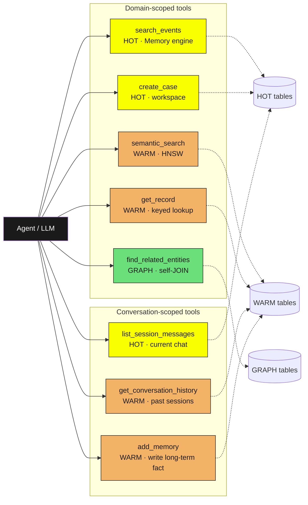
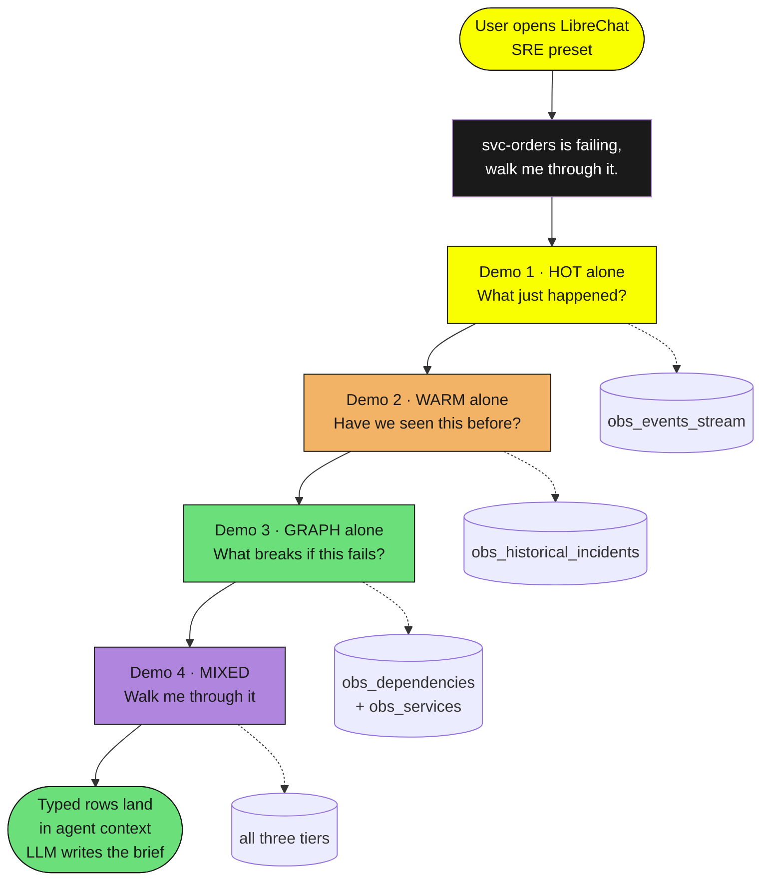

# Enterprise Agent Memory on ClickHouse

**One cluster. Three memory tiers. No stitched stack.**

AI agents need three shapes of memory: hot signals (what's happening now), history plus semantics (have we seen this before), and relationships (what's downstream). Most teams stitch four databases together to serve them, Redis plus Pinecone plus Postgres plus Neo4j, with glue code absorbing the cost. This project shows one ClickHouse cluster doing the same job with typed SQL, one auth story, and one bill.

Three runnable demos ship in the box, SRE observability, telco NetOps, and security SOC, each one walking a real investigation scenario across all three tiers. A FastMCP server exposes the same tiers as typed tools, so LibreChat and any MCP-aware agent get identical context as the CLI.

> **Memory vs context.** Memory is what's stored. Context is what reaches the LLM. This project is the memory substrate that makes good context cheap.

---

## Table of contents

1. [Quick start](#quick-start)
2. [Getting started in detail](#getting-started-in-detail)
3. [Architecture](#architecture)
4. [Memory tiers, end to end](#memory-tiers-end-to-end)
   - [HOT tier](#hot-tier-memory-engine-sub-5ms)
   - [WARM tier](#warm-tier-mergetree--hnsw-50-500ms)
   - [GRAPH tier](#graph-tier-sql-joins-on-mergetree-3-10ms)
5. [MCP tools](#mcp-tools)
6. [Demo flow](#demo-flow)
7. [Directory map](#directory-map)
8. [Reproduce every number](#reproduce-every-number)

---

## Quick start

Two paths depending on whether you want the terminal demo or the chat UI.

### Path A · CLI only (fastest)

```bash
cd cookbooks/
make setup          # writes .env from template
make start          # starts ClickHouse + demo-app containers
make seed           # populates 17 tables with synthetic data
make run            # runs all three cookbook demos (SRE, NetOps, SOC)
```

No API key needed. A deterministic hash-based embedding fallback keeps the demos reproducible without any provider credentials. Add `GOOGLE_KEY` or `OPENAI_API_KEY` to `.env` if you want live LLM narration.

### Path B · CLI plus LibreChat (full experience)

From `project_final/`:

```bash
make setup          # writes .env files in cookbooks/ and librechat/
# edit librechat/.env, add GOOGLE_KEY (Gemini is the default preset)
make all-up         # brings up cookbooks + seeds + LibreChat
open http://localhost:3080
```

LibreChat gives you the AI SRE preset wired to the `memory` MCP server. Every tool response renders tier, SQL, and latency inline so the HOT / WARM / GRAPH narrative surfaces in the chat.

---

## Getting started in detail

### Prerequisites

| Tool          | Version     | Why                                          |
|---------------|-------------|----------------------------------------------|
| Docker        | 24+         | ClickHouse + demo-app + LibreChat containers |
| Python        | 3.11+       | Local dev, benchmarks, pytest                |
| `make`        | any         | Top-level orchestration                      |
| 4 GB RAM free |             | ClickHouse + Mongo + Meilisearch + LibreChat |

### First-run checklist

1. `docker ps` returns empty or unrelated containers (no port 8123 / 3080 conflicts).
2. `cookbooks/.env` exists after `make setup`. Optional: paste a provider key.
3. `make start` logs end with `ClickHouse is ready` from the demo-app healthcheck.
4. `make seed` finishes with row counts per table.
5. `make run` prints three coloured tier transition banners, one per cookbook.

---

## Architecture



The agent talks to one endpoint. One cluster holds everything. Each tier is a ClickHouse table engine choice, not a separate piece of infrastructure.

> **Cold tier note.** ClickHouse natively supports TTL-based tiering of MergeTree parts to S3, GCS, or ABS via storage policies. This demo does NOT configure that — every table lives on the cluster's local volume. To enable it in production, attach an object-store disk in `storage_config.xml` and add `TTL ts + INTERVAL 90 DAY TO VOLUME 'cold'` to the WARM tables. See `docs/ARCHITECTURE.md` for the rough shape.

### Why one cluster beats four databases

| Pain in the stitched stack | What disappears here                                    |
|----------------------------|---------------------------------------------------------|
| Four SDKs, four auth stories | One SDK, one TLS cert, one IAM role                   |
| ETL sync between stores    | No sync, all data lives in ClickHouse                  |
| N+3 round trips per agent turn | Single cluster, typed SQL per tier                 |
| Four billing lines, four on-calls | One cluster to monitor and size                  |
| Mock / prod drift across stores | Same engine in dev, CI, and prod                  |

---

## Memory tiers, end to end

Each tier maps to a ClickHouse engine choice. The diagrams below show the data and process flow for a single tool call, from the agent picking the tool to the typed envelope landing back in the LLM context.

### HOT tier · Memory engine · sub-5ms

Real-time telemetry and investigation workspaces. Volatile on restart, in-RAM, exact scans are cheap because rows stay tiny and time-bounded.



**Tables that live here:** `obs_events_stream`, `obs_incident_workspace`, `telco_network_state`, `telco_fault_workspace`, `sec_events_stream`, `sec_case_workspace`, `conv_session_messages`.

**When HOT is the right answer:** you need the last few minutes, you need low p50 over sequential scans of a small window, you do not need historical recall.

**Honest caveat:** Redis alone is faster at single-key lookups. HOT wins here because the same cluster also serves WARM and GRAPH in the next breath of the same agent turn.

### WARM tier · MergeTree + HNSW · 50-500ms

Historical incidents, runbooks, threat intel, past conversations. MergeTree on disk with a `vector_similarity` HNSW index on a 768-dim `Array(Float32)`. The tier splits conceptually into two calls: vector similarity to find candidate IDs, then a keyed fetch to hydrate the record.



Two SQL calls live in one engine. No vector-store-to-record-store sync problem, no ID drift, same backup and same auth.

**Tables that live here:** `obs_historical_incidents`, `telco_network_events`, `sec_historical_incidents`, `sec_threat_intel`, `conv_long_term_memory`.

**Filter-first retrieval matters.** The SQL above uses the `ts >= now() - INTERVAL N DAY` predicate and a bloom-filter skip index on high-cardinality columns to prune before HNSW runs. Shrink the candidate set by metadata first, then rank by similarity. That is the tax your tokens avoid.

### GRAPH tier · SQL JOINs on MergeTree · 3-10ms

Dependency graphs, network topology, access graphs. No separate graph database, edges live in MergeTree tables, traversal is `LEFT ANY JOIN` + `UNION ALL` per hop.



**Tables that live here:** `obs_services` + `obs_dependencies`, `telco_elements` + `telco_connections`, `sec_assets` + `sec_users` + `sec_access`.

**Honest caveat:** Neo4j and Memgraph still win at shortest-path and community detection at scale. For the 2-hop blast-radius questions enterprise agents actually ask, SQL is faster because it reuses the same engine and skips the network hop.

### The mixed case · one agent turn, three tiers

The payoff is when one agent question needs all three tiers in the same turn. `svc-orders is failing, walk me through it.` becomes four tool calls, three tiers, one cluster.



---

## MCP tools

The FastMCP server at `cookbooks/mcp_server/` exposes eight typed tools. Each returns the same envelope shape, `{tier, domain, operation, sql, latency_ms, row_count, rows_preview, precision, insights}`, so the LLM sees identical structure across tiers. The `precision` block carries `rows_read`, `bytes_read`, `selectivity`, and `index_hint` so the LLM (and the reader) can audit how much data each tool actually touched.



| Tool                       | Tier  | Engine path                      | Use for                                       |
|----------------------------|-------|----------------------------------|-----------------------------------------------|
| `search_events`            | HOT   | Memory engine scan               | Live telemetry, last N minutes                |
| `create_case`              | HOT   | Memory workspace insert          | Investigation sandbox                         |
| `semantic_search`          | WARM  | HNSW `cosineDistance` top-K      | Have we seen this pattern                     |
| `get_record`               | WARM  | Keyed MergeTree read             | Hydrate runbook / resolution by ID            |
| `find_related_entities`    | GRAPH | Self-JOIN + UNION ALL            | Blast radius, topology walks                  |
| `list_session_messages`    | HOT   | Memory engine, current chat      | Replay last N turns of this session           |
| `get_conversation_history` | WARM  | HNSW across all past sessions    | Cross-session recall for this user            |
| `add_memory`               | WARM  | MergeTree insert with embedding  | Write a long-term fact the agent remembers    |

Full handler source: `cookbooks/mcp_server/server.py` and `cookbooks/mcp_server/conversation.py`. SQL templates: `cookbooks/mcp_server/queries.py`.

---

## Demo flow

Three cookbooks, one canonical entity (`svc-orders`), same three-tier pattern.



**Scenario numbers, measured live** (`python3 benchmarks/harness/run_demos.py`):

| Demo            | Tool call                     | Rows | Bytes    | p50 latency |
|-----------------|-------------------------------|------|----------|-------------|
| 1 · HOT         | `search_events`               | 200  | 27.5 KB  | 1 ms        |
| 2 · WARM        | `semantic_search`             | 14   | 25.8 KB  | 3 ms        |
| 3 · GRAPH       | `find_related_entities`       | 32   | 0.9 KB   | 3 ms        |
| 4 · MIXED       | all four tool calls           | 245  | 54.0 KB  | 6 ms total  |

Full walk-through with the exact agent prompts, tool calls, and rendered envelopes: [`docs/demo-script.md`](docs/demo-script.md).

### Other presets

- **Telco NetOps** · `make run-one COOKBOOK=telco` · anchor entity `core-router-01`
- **Security SOC** · `make run-one COOKBOOK=cybersecurity` · anchor entity `user-008`

Same three-tier pattern, different domain schema. All three share `cookbooks/shared/client.py` for the ClickHouse client, embedding, and tier-aware CLI formatting.

---

## Directory map

```
project_final/
├─ Makefile                   top-level: cli-up, librechat-up, all-up
├─ README.md                  this file
├─ docs/
│  ├─ ARCHITECTURE.md         deeper design doc (data model, deployment, scaling)
│  ├─ demo-script.md          demo walk-through with exact tool prompts
│  └─ diagrams/               source .mmd diagrams (rendered inline above)
├─ cookbooks/
│  ├─ observability/          AI SRE demo
│  ├─ telco/                  AI NetOps demo
│  ├─ cybersecurity/          AI SOC demo
│  ├─ mcp_server/             FastMCP streamable-http, 8 tools
│  ├─ shared/
│  │  ├─ client.py            ClickHouse client, embeddings, LLM, CLI formatting
│  │  ├─ schema/              ClickHouse DDL (17 tables, 3 domains)
│  │  └─ seeders/             synthetic data generators
│  ├─ docker-compose.yml      ClickHouse + demo-app
│  └─ Makefile                make setup / start / seed / run
├─ librechat/
│  ├─ docker-compose.yml      LibreChat + MongoDB + Meilisearch + memory-mcp
│  ├─ librechat.yaml          endpoints, MCP server, model presets
│  ├─ agents/                 SRE / NetOps / SOC agent builder templates
│  └─ Makefile                make setup / start / stop / logs
├─ benchmarks/
│  ├─ harness/                run_demos.py + screenshot_deck.py + run_bench.py
│  └─ results/                captured demo_scenarios.json / latest.md
└─ tests/                     integration + unit, `pytest -q`
```

---

## Reproduce every number

The latency, row-count, and byte numbers in this README and the slide deck are emitted by a single harness that hits the live ClickHouse cluster.

```bash
# bring the stack up first (see Quick start)
python3 benchmarks/harness/run_demos.py           # re-runs all 4 scenarios
python3 benchmarks/harness/run_execution_report.py # full HTML report, every SQL
```

Results land in `benchmarks/results/`:
- `demo_scenarios.json` · machine-readable, one row per tier call
- `demo_scenarios.md`   · Markdown table, what the docs cite
- `latest.md`           · last run's summary

All SQL in `cookbooks/mcp_server/queries.py`. All schema in `cookbooks/shared/schema/01_schema.sql`.

---

## License and credits

Open source demo repo. Built against ClickHouse 26.3.9.8, FastMCP, LibreChat. Gemini, OpenAI, Anthropic, Ollama, and vLLM are all first-class providers for both LLM generation and embeddings.
