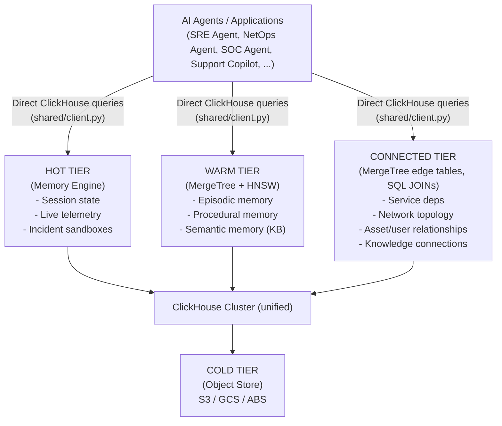

# Enterprise Memory System for AI Agents

A unified architecture using ClickHouse (Memory engine, MergeTree + HNSW, and relational edge tables) to provide AI agents with short-term, long-term, and connected memory at enterprise scale. One cluster, three tiers, no separate vector / cache / graph databases.

---

## 1. Overview

### The Problem

Enterprise AI agents are fundamentally stateless. Each invocation starts from scratch with no memory of past interactions, organizational context, or learned procedures. Traditional workarounds involve stitching together Redis for session state, Pinecone for vector search, and Neo4j for graph analytics -- creating data silos, ETL overhead, synchronization lag, and multiplied infrastructure costs.

### The Solution

Consolidate all three memory layers into a single ClickHouse cluster:

- **Short-term memory** (session-active state) via ClickHouse Memory engine tables
- **Long-term memory** (persistent knowledge) via MergeTree tables with HNSW vector indexes
- **Connected memory** (relationship graphs) via MergeTree edge tables walked with SQL JOIN + UNION ALL

### Why ClickHouse

| Requirement | ClickHouse Capability |
|---|---|
| Sub-millisecond session memory | Memory engine (RAM-based tables) |
| Semantic search at scale | Native HNSW vector indexes on Array(Float32) |
| Structured filtering + analytics | Columnar storage, distributed SQL |
| Graph traversal | Self-JOIN + UNION ALL on MergeTree edge tables (obs_dependencies, telco_connections, sec_access) |
| Cost efficiency | Columnar compression (measured: 5-63x on structured columns at bench scale; see below) plus tiered storage to S3 |
| Horizontal scaling | Distributed tables, sharding, replication |

This eliminates the need for separate vector, graph, and cache databases. Measured against the matched stitched-stack reference implementation in `comparison/`:

- **Lines of code:** 162 vs 382 (58% reduction, blanks/comments excluded; 184 vs 465 raw)
- **Database client libraries:** 1 vs 4 (`clickhouse_connect` vs `redis` + `pinecone` + `neo4j` + `psycopg2`)
- **Distinct backing services:** 1 vs 4
- **Query languages in flight:** 1 (SQL) vs 4 (Redis cmd, Pinecone REST, Cypher, SQL)
- **Operational surfaces:** 1 vs 4 (one cluster to backup, upgrade, monitor, secure)
- **Cross-tier writes in one transaction:** yes vs no
- **Cross-tier JOINs in one query:** yes vs no

Reproduce: `cd comparison && make compare`.

### Compression — measured

Per-column compression ratios on `obs_historical_incidents` at bench scale (50,000 incidents, isolated cluster on :18124):

| Column | Type | Uncompressed | Compressed | Ratio |
|---|---|---|---|---|
| `severity` | Enum8 | 48 KiB | 783 B | **63x** |
| `ts` | DateTime64(3) | 385 KiB | 11 KiB | **34x** |
| `description` | String (text) | 3.70 MiB | 602 KiB | 6.3x |
| `title` | String (text) | 2.24 MiB | 376 KiB | 6.1x |
| `affected_services` | Array(String) | 1.80 MiB | 303 KiB | 6.0x |
| `resolution` | String (text) | 1.27 MiB | 231 KiB | 5.6x |
| `root_cause` | String (text) | 1.34 MiB | 249 KiB | 5.5x |
| `duration_min` | UInt32 | 192 KiB | 141 KiB | 1.4x |
| `embedding` | Array(Float32) random | 144.91 MiB | 143.63 MiB | 1.0x |
| `incident_id` | UUID (random) | 770 KiB | 774 KiB | 1.0x |

The takeaway: column shape determines the ratio. Enums and timestamps compress 30-60x. Natural language text 5-7x. Random vectors and UUIDs are incompressible by design. Whole-table ratio is dominated by the largest column — for vector-heavy tables this is ~1.0x; strip the vector and the same table compresses ~6.6x.

Reproduce: `cd benchmarks && make up && make seed && curl -u default:clickhouse "http://localhost:18124/?database=enterprise_memory" --data "SELECT column, formatReadableSize(sum(column_data_uncompressed_bytes)) AS u, formatReadableSize(sum(column_data_compressed_bytes)) AS c, round(sum(column_data_uncompressed_bytes)/sum(column_data_compressed_bytes), 2) AS ratio FROM system.parts_columns WHERE database='enterprise_memory' AND table='obs_historical_incidents' AND active GROUP BY column ORDER BY ratio DESC FORMAT PrettyCompact"`.

### Bloom filter pruning — measured

A/B test on `obs_historical_incidents` at bench scale (50k incidents, 13 partitions, 25 granules) with the bloom filter index `idx_incident_id`:

| Run | rows read | bytes read | duration |
|---|---|---|---|
| WITH bloom filter | 665 | 10.4 KiB | 25 ms |
| WITHOUT (`use_skip_indexes=0`) | 50,000 | 781 KiB | 4 ms |

**Bloom prunes 98.67% of rows** on a UUID lookup. At this scale the data is in RAM so the full scan happens to win on latency (4 ms vs 25 ms — bloom-check overhead). The data-volume story is real and translates directly to fewer disk I/Os when the working set exceeds memory; the latency story flips at production scale where the full scan would hit storage.

Reproduce: `cd benchmarks && make up && make seed`, then run the EXPLAIN + A/B in the verification-report at `docs/verification-report.md` § 9.

---

## 2. Architecture

### Three-Tier Memory Model



### Tier Details

**Tier 1 -- Hot Memory (Memory Engine)**
- Active agent sessions and conversations
- Real-time log/metric/event streams
- Ephemeral investigation sandboxes
- Retention: minutes to hours (cleared on restart)
- Latency: sub-millisecond
- Supports exact vector search via cosineDistance/L2Distance

**Tier 2 -- Warm Memory (ReplicatedMergeTree)**
- Historical interactions, incidents, resolutions
- Knowledge base articles, procedures, threat intelligence
- HNSW vector indexes for approximate nearest neighbor search
- Retention: days to years (TTL-based tiering to cold)
- Latency: 10-50ms for vector search, 50-200ms for graph traversal

**Tier 3 -- Cold Memory (Object Storage)**
- Compliance and audit archives
- Infrequently accessed historical data
- Automated via ClickHouse TTL policies (80% cost reduction vs SSD)
- Retention: months to years

### Data Flow Patterns

**Ingestion and Aging:**
1. Agent interactions write to Memory tables (hot tier)
2. Background service generates embeddings for completed sessions
3. Periodic flush (5-15 min) moves data to MergeTree (warm tier)
4. TTL policies move data older than 90 days to object storage (cold tier)
5. Graph relationships are immediately visible via the edge MergeTree tables (obs_dependencies, telco_connections, sec_access) and reachable through the same SQL engine

**Hybrid Retrieval:**
1. Check hot tier for current session memory
2. Vector search on warm tier for semantically similar memories
3. SQL filtering for structured constraints (time range, entity, type)
4. Graph traversal for relationship discovery
5. Results synthesized into context package for agent LLM prompt

**Continuous Learning:**
- Successful resolutions marked with high importance scores and retained longer
- Failed approaches flagged for review
- New incidents enrich the knowledge base for future retrieval

---

## 3. Technology Stack

### ClickHouse

**Memory Engine** -- stores data in RAM for sub-millisecond reads and writes. Ideal for ephemeral session data and real-time streams. Supports full SQL including joins, aggregations, and exact vector distance functions. Data is intentionally lost on restart, matching short-term memory semantics.

**MergeTree Engine** -- persistent columnar storage with 10:1+ compression. Supports HNSW vector indexes for approximate nearest neighbor search on billions of embeddings. Partitioning by time enables efficient range queries. TTL policies automate data lifecycle from SSD to object storage.

**Vector Search** -- uses Array(Float32) columns to store embeddings. Two modes:
- Memory tables: exact search via `cosineDistance(embedding, query_vector)` -- fast enough for thousands to millions of vectors
- MergeTree tables: approximate search via HNSW index (`TYPE hnsw(metric='cosine')`) -- required for billion-scale datasets

**Scaling** -- horizontal scaling via distributed tables. Shard by tenant_id for isolation or by time for time-series workloads. 2-3 replicas per shard for high availability. Expected: 1B interactions ~ 1TB after compression.

### Graph via SQL JOINs

The graph tier is plain MergeTree tables for vertices (`obs_services`, `telco_elements`, `sec_assets`, `sec_users`) and edges (`obs_dependencies`, `telco_connections`, `sec_access`). Multi-hop traversals are expressed as self-JOIN + UNION ALL, one branch per hop depth. Measured 2-hop blast radius: ~3 ms p50 on the seeded cluster, 53 rows scanned, 1.3 KB read.

**Why not a dedicated graph DB:** for 1-3 hop traversals at single-digit-million edge counts, SQL on ClickHouse wins on latency and operational simplicity. A separate graph database would add another service, another auth story, another sync pipeline, and another on-call rotation, with no latency benefit.

**When a graph DB earns its seat:** shortest-path, pagerank, community detection, or traversals that benefit from procedural Cypher/Gremlin at depths beyond 3 hops. None of these apply to the agent-memory workload here.

**Example (2-hop upstream blast radius):**

```sql
SELECT d.from_service AS related, s.criticality, d.dep_type, 1 AS hops
FROM obs_dependencies d
JOIN obs_services s ON s.service_id = d.from_service
WHERE d.to_service = 'svc-orders'
UNION ALL
SELECT d2.from_service, s2.criticality, d2.dep_type, 2 AS hops
FROM obs_dependencies d2
JOIN obs_services s2 ON s2.service_id = d2.from_service
WHERE d2.to_service IN (
    SELECT from_service FROM obs_dependencies WHERE to_service = 'svc-orders'
)
```

### Embedding Model

Pluggable -- supports OpenAI text-embedding-3, SentenceTransformers (all-MiniLM-L6-v2), or other models. The Memory & Embedding Service handles vectorization transparently.

---

## 4. Data Model

### 4.1 Core Tables

These three tables are the generic agent-memory surface, defined in
`cookbooks/shared/schema/02_agent_memory.sql` and exercised by the
conversation MCP tools `list_session_messages`,
`get_conversation_history`, and `add_memory`. The
domain-specific tables in sections 4.2 through 4.4 live alongside
them and are addressed by the domain tools.

**Short-Term Memory: `agent_memory_hot`**

Volatile per-session scratchpad. Every user, assistant, and tool turn
in the current chat is written here first for sub-5ms replay. Data is
intentionally lost on restart.

```sql
CREATE TABLE enterprise_memory.agent_memory_hot
(
    session_id    String,
    turn_id       UInt32,
    role          LowCardinality(String),    -- 'user' | 'assistant' | 'tool'
    content       String,
    tool_name     LowCardinality(String) DEFAULT '',
    metadata      String                 DEFAULT '',
    ts            DateTime64(3)          DEFAULT now64()
) ENGINE = Memory;
```

**Long-Term Memory: `agent_memory_long`**

Persistent, semantically searchable conversation memory. Flushed rows
from `agent_memory_hot` plus deliberate "remember this" writes from
the agent. HNSW vector index enables cross-session recall via
`cosineDistance`.

```sql
CREATE TABLE enterprise_memory.agent_memory_long
(
    memory_id          UUID                   DEFAULT generateUUIDv4(),
    user_id            String,
    agent_id           LowCardinality(String) DEFAULT '',
    session_id         String,
    turn_id            UInt32                 DEFAULT 0,
    role               LowCardinality(String) DEFAULT 'assistant',
    content            String,
    content_embedding  Array(Float32),
    memory_type        LowCardinality(String) DEFAULT 'episodic',   -- 'episodic' | 'procedural' | 'semantic'
    importance         Float32                DEFAULT 0.5,
    ts                 DateTime64(3)          DEFAULT now64(),

    INDEX embedding_idx content_embedding TYPE hnsw(metric='cosine')
) ENGINE = MergeTree()
PARTITION BY toYYYYMM(ts)
ORDER BY (user_id, ts, session_id);
```

**Knowledge Base: `knowledge_base`**

Durable reference knowledge: how-tos, policy notes, playbook
fragments. Distinct from the domain `historical_*` tables, which hold
past incident records rather than curated reference material.

```sql
CREATE TABLE enterprise_memory.knowledge_base
(
    article_id         UUID                   DEFAULT generateUUIDv4(),
    title              String,
    content            String,
    content_embedding  Array(Float32),
    category           LowCardinality(String) DEFAULT 'general',
    tags               Array(String)          DEFAULT [],
    created_at         DateTime64(3)          DEFAULT now64(),
    updated_at         DateTime64(3)          DEFAULT now64(),
    access_count       UInt32                 DEFAULT 0,

    INDEX embedding_idx content_embedding TYPE hnsw(metric='cosine')
) ENGINE = MergeTree()
ORDER BY (category, article_id);
```

> Note: the schema file ships as single-node `MergeTree`; swap to
> `ReplicatedMergeTree` and add a `TTL ts + INTERVAL 90 DAY TO VOLUME 'cold'`
> clause for production deployments with tiered storage configured.

### 4.2 Observability Domain Tables

```sql
-- Real-time log/metric stream (hot tier)
CREATE TABLE logs_stream
(
    timestamp       DateTime64(3),
    service         LowCardinality(String),
    level           LowCardinality(String),
    trace_id        String,
    message         String,
    metrics_json    String
) ENGINE = Memory;

-- Per-incident investigation sandbox (hot tier, created dynamically)
CREATE TABLE incident_{id}
(
    timestamp       DateTime64(3),
    source          String,
    data_type       LowCardinality(String),  -- 'log', 'metric', 'trace'
    content         String,
    trace_id        String
) ENGINE = Memory;
```

Graph view: Service Dependency edge tables (`obs_services` as vertex, `obs_dependencies` as edge). 2-hop blast radius via SQL self-JOIN + UNION ALL.

### 4.3 Telco Network Domain Tables

```sql
-- Real-time network element state (hot tier)
CREATE TABLE network_state
(
    element_id      String,
    element_type    LowCardinality(String),  -- 'router', 'switch', 'fiber'
    status          LowCardinality(String),  -- 'up', 'down', 'degraded'
    metrics_json    String,
    last_updated    DateTime64(3)
) ENGINE = Memory;

-- Historical network events (warm tier)
CREATE TABLE network_events
(
    element_id      String,
    timestamp       DateTime64(3),
    event_type      LowCardinality(String),
    packet_loss     Float32,
    latency_ms      Float32,
    description     String,
    embedding       Array(Float32),

    INDEX embedding_idx embedding TYPE hnsw(metric='cosine')
) ENGINE = ReplicatedMergeTree()
PARTITION BY toYYYYMM(timestamp)
ORDER BY (element_id, timestamp);
```

Graph view: Network Topology edge tables (`telco_elements` as vertex, `telco_connections` as edge). Multi-hop downstream impact via SQL self-JOIN + UNION ALL.

### 4.4 Cybersecurity Domain Tables

```sql
-- Real-time security event stream (hot tier)
CREATE TABLE security_events_stream
(
    timestamp       DateTime64(3),
    event_type      String,
    source_system   String,
    user_id         String,
    asset_id        String,
    ip_address      String,
    action          String,
    outcome         String,
    severity        String
) ENGINE = Memory;

-- Threat intelligence (warm tier)
CREATE TABLE threat_intelligence
(
    indicator_id      UUID,
    indicator_type    String,
    indicator_value   String,
    embedding         Array(Float32),
    threat_actor      String,
    campaign          String,
    ttps              Array(String),
    confidence_score  Float32,

    INDEX embedding_idx embedding TYPE hnsw(metric='cosine')
) ENGINE = ReplicatedMergeTree()
ORDER BY (indicator_type, confidence_score);

-- Historical incidents (warm tier)
CREATE TABLE historical_incidents
(
    incident_id       UUID,
    timestamp         DateTime64(3),
    incident_type     String,
    description       String,
    embedding         Array(Float32),
    root_cause        String,
    response_actions  String,
    outcome           String,
    severity_score    Float32,

    INDEX embedding_idx embedding TYPE hnsw(metric='cosine')
) ENGINE = ReplicatedMergeTree()
PARTITION BY toYYYYMM(timestamp)
ORDER BY (incident_type, severity_score, timestamp);
```

Graph view: Security Asset edge tables (`sec_users`, `sec_assets` as vertices; `sec_access` as edge). Lateral-access reachability via SQL self-JOIN + UNION ALL.

### 4.5 Graph traversal pattern (SQL)

The graph tier is always expressed as a self-JOIN + UNION ALL pattern, one branch per hop depth. Example: 2-hop upstream dependents of a service.

```sql
-- Hop 1: direct dependents.
SELECT d.from_service AS related, s.criticality, d.dep_type, 1 AS hops
FROM obs_dependencies d
JOIN obs_services s ON s.service_id = d.from_service
WHERE d.to_service = {entity:String}

UNION ALL

-- Hop 2: services that depend on services that depend on the target.
SELECT d2.from_service, s2.criticality, d2.dep_type, 2 AS hops
FROM obs_dependencies d2
JOIN obs_services s2 ON s2.service_id = d2.from_service
WHERE d2.to_service IN (
    SELECT from_service FROM obs_dependencies WHERE to_service = {entity:String}
)
AND {max_hops:UInt32} >= 2
```

Measured against the seeded cluster (10 services, 11 dependency edges): 53 rows scanned, 1.3 KB read, 3 ms p50 duration. This pattern extends straightforwardly to telco_connections (downstream network elements) and sec_access (user-to-asset reachability).

---

## 5. Use Cases

### 5.1 Observability -- AI SRE Agent

**Scenario:** SRE team at a large e-commerce company deploys an autonomous AI SRE Agent to detect incidents, perform root cause analysis, and automate remediation across a microservices environment.

**Memory mapping:**
- Hot tier: `logs_stream` ingests real-time logs/metrics; `incident_{id}` tables serve as investigation sandboxes
- Warm tier: `memory_long` stores historical incidents with vector embeddings for semantic search
- Connected: MergeTree edge tables (`obs_dependencies`) model service dependencies; 2-hop blast radius via SQL self-JOIN

**Workflow:**

| Step | Agent Action | Memory System Activity |
|---|---|---|
| 1. Detect | Spike in 5xx errors on `api-gateway` | Hot: query `logs_stream` every second; threshold exceeded |
| 2. Triage | Create incident `inc-123`, populate sandbox | Hot: create `incident_inc-123` Memory table; load 5 min of related logs, metrics, traces |
| 3. Correlate | Find corresponding CPU spike on `checkout-service` | Hot: join logs and metrics by `trace_id` in sandbox |
| 4. Search history | Find similar past incidents | Warm: vector search on `memory_long` -- finds similar incident caused by memory leak |
| 5. Root cause | Trace `checkout-service` dependencies | Connected: `MATCH (s:Service {name:'checkout-service'})-[:DEPENDS_ON]->(d) RETURN d.name` -- discovers recently updated library |
| 6. Remediate | Rollback `checkout-service` to previous version | Agent synthesizes findings from all three tiers, executes automated rollback |
| 7. Learn | Document investigation and resolution | Warm: vectorize and persist sandbox contents to `memory_long` |

### 5.2 Telco Network -- AI NetOps Agent

**Scenario:** Major telecom provider deploys an AI NetOps Agent to maintain real-time network inventory, predict component failures, and automate network optimization across millions of physical and logical components.

**Memory mapping:**
- Hot tier: `network_state` holds real-time operational state and metrics for every network element
- Warm tier: `network_events` and `inventory_history` store historical performance data for predictive maintenance
- Connected: MergeTree edge tables (`telco_connections` + `telco_elements`) model network topology; multi-hop downstream impact via SQL self-JOIN

**Workflow:**

| Step | Agent Action | Memory System Activity |
|---|---|---|
| 1. Monitor | Detect router `rtr-42` with abnormal packet loss | Hot: query `network_state` every 5s; flag `status='degraded'` |
| 2. Trend | Retrieve 30-day performance history | Warm: query `network_events` -- finds steady increase in packet loss over 2 weeks |
| 3. Predict | Forecast 95% failure probability within 72 hours | Warm: predictive model trained on `inventory_history` |
| 4. Impact | Determine business impact of potential failure | Connected: `MATCH (r:Router {id:'rtr-42'})<-[:USES]-(c:Circuit)-[:BELONGS_TO]->(cust:Customer {tier:'enterprise'}) RETURN count(cust)` -- 35 enterprise customers affected |
| 5. Reroute | Find redundant path with sufficient capacity | Connected: `MATCH path=(c:Circuit)-[:VIA*]->(r:Router) WHERE NOT 'rtr-42' IN nodes(path) RETURN path` |
| 6. Execute | Create change request; reroute traffic automatically | Agent orchestrates configuration changes using topology context |
| 7. Learn | Persist prediction pattern and resolution | Warm: save to `network_events` for future predictive model improvement |

### 5.3 Cybersecurity -- AI SOC Agent

**Scenario:** Global financial services company deploys an autonomous AI SOC Agent to automate threat detection, investigation, and response in a 24/7 Security Operations Center overwhelmed by alert volume and analyst burnout.

**Memory mapping:**
- Hot tier: `security_events_stream` ingests real-time logs from firewalls, EDR, cloud providers, identity systems; `case_{id}_workspace` tables serve as investigation sandboxes
- Warm tier: `threat_intelligence` stores IoCs, threat actor profiles, TTPs; `historical_incidents` stores past incidents with vector embeddings
- Connected: MergeTree edge tables (`sec_access`, `sec_users`, `sec_assets`) model user-asset reachability; lateral-access graph via SQL self-JOIN

**Workflow:**

| Step | Agent Action | Memory System Activity |
|---|---|---|
| 1. Detect | Suspicious login to production DB from high-risk IP | Hot: query `security_events_stream` -- flags `asset_criticality='high'`, `ip_geo_risk='high'` |
| 2. Investigate | Create case `case-9876`, build workspace | Hot: create `case_9876_workspace` Memory table; load 60 min of related user/IP/asset logs |
| 3. Enrich | Gather user roles, asset sensitivity, IP history | Connected: graph queries -- user is DB admin, never logged in from this IP, asset contains PII |
| 4. Correlate | Check IP against threat intelligence | Warm: lookup in `threat_intelligence` -- IP is known C2 server for FIN6 threat actor |
| 5. Precedent | Search for similar past incidents | Warm: vector search on `historical_incidents` -- finds 2 similar admin account compromises |
| 6. Respond | Suspend user session, isolate server, block IP | Agent sends API calls to identity provider, EDR system, and firewall |
| 7. Learn | Document incident and enrich knowledge base | Warm: vectorize and write to `historical_incidents`; add IoC to `threat_intelligence` with increased confidence |

### Cross-Use-Case Comparison

| Aspect | Observability | Telco Network | Cybersecurity |
|---|---|---|---|
| Primary Goal | Reduce incident MTTR | Predictive maintenance | Autonomous threat response |
| Hot Tier | logs_stream, incident sandbox | network_state | security_events_stream, case workspace |
| Warm Tier | memory_long (incidents) | network_events, inventory_history | threat_intelligence, historical_incidents |
| Graph Use | Service dependencies | Network topology | Asset/user relationships |
| Key Metric | Incident resolution time | Failure prediction accuracy | Mean time to respond |
| Automation Level | Semi-autonomous | Semi-autonomous | Fully autonomous |

---

## 6. Deployment

### Docker Compose

The project runs via `docker compose` with two services:

```yaml
services:
  clickhouse:
    image: clickhouse/clickhouse-server:26.3
    ports:
      - "8123:8123"
      - "9000:9000"
    volumes:
      - ./shared/schema:/docker-entrypoint-initdb.d

  demo-app:
    build: .
    env_file: .env
    environment:
      CLICKHOUSE_HOST: clickhouse
```

### CLI Cookbook Runner

The demo-app container runs the cookbook CLI via `python main.py`. Each cookbook
directly queries ClickHouse using `clickhouse-connect` (via `shared/client.py`),
generates embeddings using the configured provider, and displays results using
Rich terminal formatting.

### Multi-Provider Support

Embedding and LLM generation are pluggable via environment variables. Supports
Gemini, OpenAI, Anthropic, Ollama, and vLLM. When no provider key is set, a
deterministic hash-based embedding fallback is used so the demos work without
any API keys.

### Performance Targets

| Query Type | Expected Latency |
|---|---|
| Hot tier session lookup | < 1ms |
| Vector search (10M embeddings) | 10-50ms |
| Graph traversal (3-hop) | 50-200ms |
| Hybrid query (vector + SQL + graph) | 100-300ms |

### Capacity Planning

| Metric | Estimate |
|---|---|
| Storage per interaction (compressed) | ~1 KB |
| Embedding storage (1536-dim) | ~6 KB per vector |
| 1B interactions total storage | ~1 TB |
| RAM for optimal performance | 10-20% of dataset size |
| SSD cost | ~$0.10/GB/month |
| Object storage cost | ~$0.02/GB/month |
